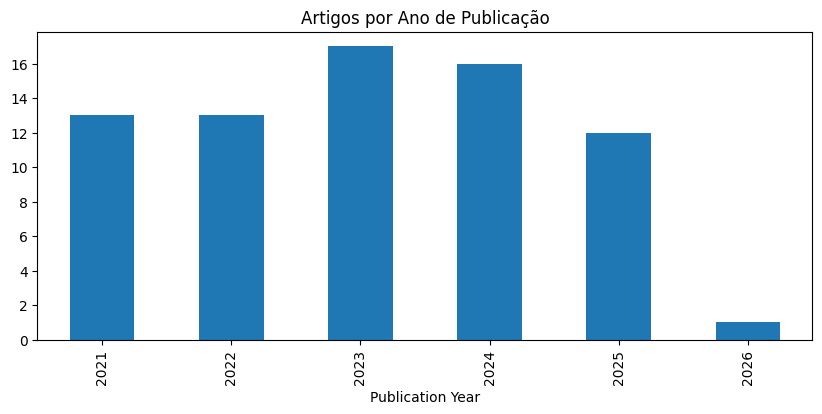
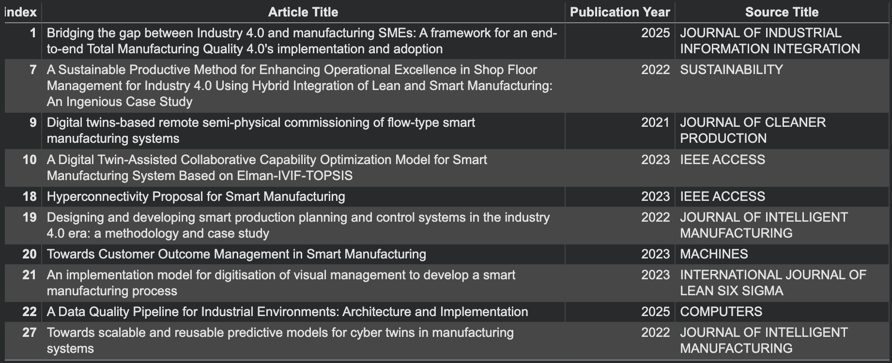
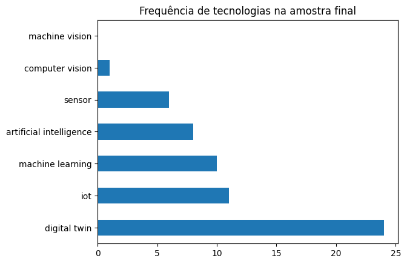

# 📊 Triagem Bibliométrica — E-book Quality 4.0

> **Systematic literature screening** aplicado a 72 artigos Open Access sobre Qualidade na Indústria 4.0,
> com foco em tecnologias habilitadoras: IoT, Machine Learning, Computer Vision, Digital Twin e Sensores.

---

## 🎯 Objetivo

Identificar, dentro de uma base de 72 artigos científicos Open Access (Web of Science), aqueles com aplicação técnica direta de tecnologias habilitadoras da Qualidade 4.0 — gerando a **"Amostra Diamante"** que fundamenta o conteúdo do e-book.

Este repositório documenta o pipeline de triagem: da base bruta ao conjunto curado, reproduzível e rastreável.

---

## 🗂️ Estrutura do repositório

```
ebook-quality-4.0-screening/
│
├── README.md
├── data/
│   └── e-book_acesso-aberto_72docs.xls    ← Base exportada do Web of Science
├── notebooks/
│   └── base_artigos_ebook_qualidade.ipynb        ← Pipeline completo de triagem
├── outputs/
│   └── ebook_amostra_diamante_qualidade.xlsx             ← Resultado: artigos selecionados
└── assets/
    └── graficos/
        ├── artigos_por_ano.png
        ├── frequencia_tecnologias.png
        └── top_periodicos.png
```

---

## 🔬 Metodologia

### 1. Fonte dos dados
Exportação direta do **Web of Science** com filtro inicial:
- Tema: `Quality AND Industry 4.0`
- Tipo de acesso: Open Access
- Resultado: 72 artigos

### 2. Critério de triagem
Filtragem por presença de termos de **tecnologia habilitadora** nos campos `Article Title` e `Abstract`, via expressão regular:

```python
regex_tecnologia = r'\b(machine vision|computer vision|digital twin\w*|iot|
                        internet of things|machine learning|artificial intelligence|
                        ai|sensor\w*)\b'
```

A seleção dos termos foi baseada na literatura de referência sobre tecnologias da Indústria 4.0 aplicadas ao controle de qualidade.

### 3. Resultado
| Etapa | Artigos |
|---|---|
| Base inicial (Open Access) | 72 |
| Após triagem por tecnologia | *N = 37* |
| Taxa de retenção | *51.4% retidos* |


---

## 🛠️ Tecnologias utilizadas


- `pandas` — manipulação e filtragem da base
- `re` — expressões regulares para extração de termos
- `matplotlib` / `seaborn` — visualizações exploratórias
- Ambiente: Google Colab

---

## ▶️ Como reproduzir

```bash
# 1. Clone o repositório
git clone https://github.com/engineer-ana/ebook-quality-4.0-screening.git
cd ebook-quality-4.0-screening

# 2. Instale as dependências
pip install pandas openpyxl matplotlib seaborn jupyter

# 3. Execute o notebook
jupyter notebook notebooks/base_artigos_ebook_qualidade.ipynb
```


---

## 📈 Resultados visuais

*Gráficos gerados automaticamente pelo notebook (ver pasta `/assets/graficos/`)*

| Distribuição por ano | Top periódicos | Frequência por tecnologia |
|---|---|---|
|  |  |  |

---

## 🔗 Contexto do projeto

Este pipeline de triagem é parte da produção do **E-book Quality 4.0** — um produto educacional técnico que consolida evidências científicas sobre aplicações de tecnologias da Indústria 4.0 no controle e gestão da qualidade industrial.

O e-book é voltado para engenheiros e profissionais de processos que buscam fundamentação técnica para projetos de modernização.

---

## 👩‍💻 Sobre a autora

**Ana Maria Barbosa Dias**
Engenheira de Produção | Mestre em Engenharia Têxtil (Indústria 4.0) — UFSC

Atuando na interseção entre **engenharia industrial**, **pesquisa aplicada** e **análise de dados**.

[](https://linkedin.com/in/anamariadias)
[](https://github.com/engineer-ana)

---

## 📄 Licença

Este repositório é de uso educacional e demonstrativo.
Os dados utilizados são provenientes de fontes públicas (artigos Open Access — Web of Science).
